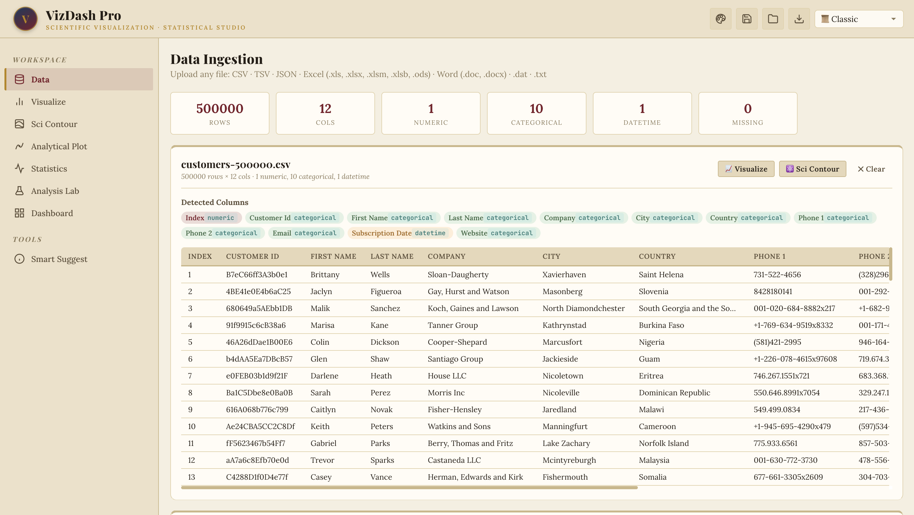
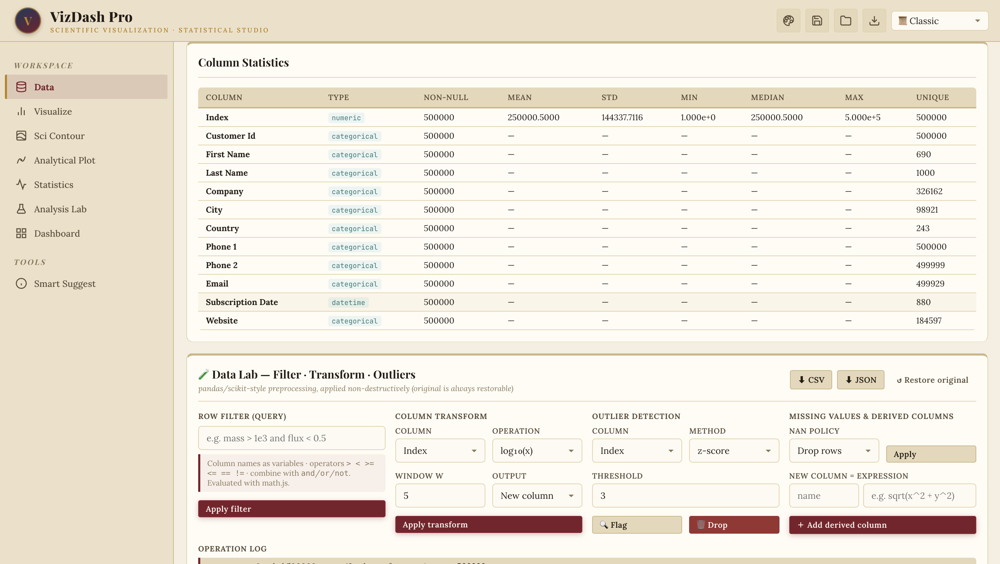
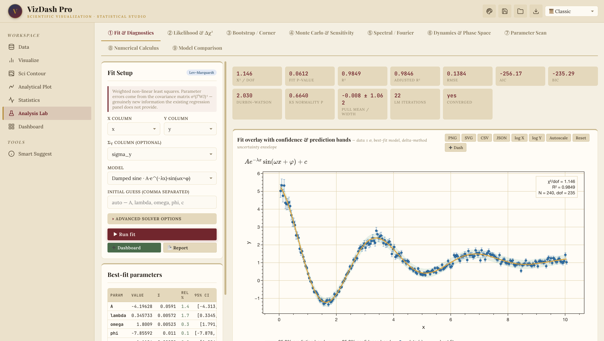

<div align="center">

# 🔬 VizDash Pro

### Scientific Visualization &amp; Statistical Studio

**Plot it. Analyse it. All in your browser.**
46 plot types, statistics without code, and a full inference lab — in one HTML file.
No install. No backend. No sign-up.

<br>

### 🔗 **[Try it Live Here](https://ouseph444.github.io/VizDash-Pro-/)**

<br>


</div>

---

## ✨ What is it?

Everyone should be able to plot and analyse their own data — without installing Python first.

Drop in a CSV, Excel sheet, or JSON file and VizDash Pro gives you **46 plot types**, a
data-cleaning bench, and regression and hypothesis tests you drive from a dropdown. Then,
when you need to go further, it keeps going into the inference layer that usually forces you
into a notebook: non-linear fitting with real parameter uncertainties, goodness-of-fit
diagnostics, likelihood profiles, bootstrap corner plots, Monte-Carlo error propagation,
Fourier analysis, and phase-space dynamics.

Whether it's your first histogram or your hundredth model fit.

> **Your data never leaves your machine.** Everything — parsing, fitting, FFTs, Monte Carlo —
> runs in your browser. Nothing is uploaded anywhere.

---

## 📸 Screenshots

### Ingest almost anything — CSV · TSV · JSON · Excel · Word · `.dat` · `.txt`

Automatic type detection (numeric / categorical / datetime), missing-value counts, and an
instant preview. Here: a **500,000-row × 12-column** customer dataset.



<br>

### Column statistics &amp; the Data Lab

Full descriptive statistics per column, then a **pandas/scikit-style preprocessing bench** —
row filters, 24 column transforms, four outlier detectors, missing-value policies and derived
columns. Every operation is **non-destructive**: the original upload is always one click away.



<br>

### The Analysis Lab — where it stops being a chart tool

Weighted non-linear least squares with Levenberg–Marquardt, parameter errors from the
covariance matrix, confidence &amp; prediction bands, and a full diagnostic suite. The LaTeX
model, the fit statistics and the 95 % intervals are all live.



---

## 🧪 The Analysis Lab — 9 panels, 34 purpose-built figures

| # | Panel | What it gives you |
|:--:|---|---|
| ① | **Fit &amp; Diagnostics** | Levenberg–Marquardt fitting · 17 built-in models + custom expressions · confidence &amp; prediction bands · residuals · Normal Q–Q · pull distribution · scale-location · leverage &amp; Cook's distance · residual ACF |
| ② | **Likelihood &amp; Δχ²** | 1-D profile likelihood with **asymmetric** errors · 2-D Δχ² confidence regions (68/95/99 %) · Gaussian-ellipse comparison · exclusion / significance maps |
| ③ | **Bootstrap / Corner** | Case · residual · wild · parametric resampling → corner plot with marginal posteriors, joint densities, parameter correlation matrix and a model envelope |
| ④ | **Monte Carlo &amp; Sensitivity** | Propagate input distributions through any formula → full output PDF/CDF · sensitivity tornado · variance decomposition · input–output scatter matrix |
| ⑤ | **Spectral / Fourier** | FFT amplitude spectrum · Welch PSD with a white-noise significance floor · spectrogram (STFT) · cumulative power &amp; unwrapped phase · automatic peak detection |
| ⑥ | **Dynamics &amp; Phase Space** | Vector fields · streamlines · nullclines · **classified** fixed points · RK4 trajectories · live parameter sliders · click-to-launch orbits · animation · 3-D attractors |
| ⑦ | **Parameter Scan** | Dense 2-D log/linear contour maps with labelled iso-lines, exclusion regions and click-driven cross-sections — computed in a **Web Worker** |
| ⑧ | **Numerical Calculus** | Derivatives · cumulative integrals (trapezoid vs Simpson) · smoothing (Savitzky–Golay, median, Gaussian) · interpolation (cubic spline, PCHIP) · roots · extrema · inflections |
| ⑨ | **Model Comparison** | Fit up to 14 candidate models at once · AIC / AICc / BIC · Akaike weights · 5-fold cross-validated RMSE · ratio / difference / relative-error / pull panels |

---

## 📊 Plus everything the studio already did

<table>
<tr>
<td width="50%" valign="top">

**Visualize**
46 plot types across 7 categories — basic, statistical, multivariate,
3-D, time series, composition and specialised. Multi-layer, each layer
with its own file and column mapping. LaTeX axis labels, log/log₂ scales,
reference lines, 8 palettes.

**Sci Contour**
Scattered (x, y, z) → IDW-gridded iso-contour maps with a hand-written
marching-squares contourer, annotations and log axes.

</td>
<td width="50%" valign="top">

**Analytical Plot**
Plot closed-form expressions in 2-D and 3-D with live parameters.

**Statistics**
OLS / multiple / polynomial / logistic regression · 7 hypothesis tests ·
MCMC posterior sampling.

**Dashboard**
Pin any figure, 30 grid layouts, drag to reorder, export as JSON,
self-contained HTML, or batch PNG.

</td>
</tr>
</table>

---

## 🎯 Built for publication

- **Vector SVG &amp; high-DPI PNG export** on *every* figure — up to 6× scale
- **CSV / JSON export** of the underlying numbers, not just the picture
- **Global figure style panel** — font family &amp; size, line width, colourway, transparent
  backgrounds, mirrored axes, scientific tick notation, minor ticks
- **LaTeX** throughout, via MathJax and KaTeX
- **Colourblind-safe** (Okabe–Ito) default palette
- 5 themes — Classic · Dark · Light · Publication · Midnight

---

## ✅ Validated against known ground truth

The numerics aren't just "it renders". Every routine was checked against problems with
analytic answers:

| Check | Expected | Measured |
|---|---|---|
| LM recovers a damped oscillator | λ = 0.35, ω = 1.80 | **0.34573 ± 0.0057**, **1.8009 ± 0.0052** ✓ |
| Reduced χ² with correct errors | ≈ 1 | **1.146** (p = 0.061) ✓ |
| Profile vs covariance errors | should agree for a near-linear model | σ = 0.0591 vs **+0.0587 / −0.0593** ✓ |
| FFT recovers injected tones | 1.7 Hz, 4.3 Hz | **1.6805**, **4.2946** ✓ |
| Lotka–Volterra fixed points | saddle (0,0); centre (3, 2.75) | **exact match**, λ = 0 ± 0.995i ✓ |
| Van der Pol origin (μ = 1.5) | 0.75 ± 0.661i | **0.750 ± 0.661i** ✓ |
| Model comparison picks the truth | the generating model | rank 1, **100 % Akaike weight** ✓ |
| Bootstrap bias (200 refits) | ≈ 0 | **≤ 0.0055**, 200/200 converged ✓ |

---

## 🚀 Quick start

**Online —** just open the [live page](https://ouseph444.github.io/VizDash-Pro-/).

**Locally —**

```bash
git clone https://github.com/ouseph444/VizDash-Pro-.git
cd VizDash-Pro-
open index.html          # macOS  ·  or: xdg-open / start
```

That's the whole install. No `npm`, no bundler, no server.

**No data handy?** Open **Analysis Lab → 🧬 Load demo data** for a synthetic 240-row set
(damped oscillator with heteroscedastic errors, a two-tone signal, a power law and a Gaussian
peak) that exercises every panel.

### ⌨️ Shortcuts

| Key | Action | | Key | Action |
|:--:|---|---|:--:|---|
| <kbd>1</kbd>–<kbd>8</kbd> | Jump to a workspace tab | | <kbd>G</kbd> | Global figure style |
| <kbd>R</kbd> | Re-render the active figure | | <kbd>?</kbd> | Help |
| <kbd>S</kbd> | Save session to JSON | | <kbd>Esc</kbd> | Close modal / stop animation |

---

## 🛠 Built with

Everything is client-side, loaded from CDN:

[**Plotly**](https://plotly.com/javascript/) rendering · [**math.js**](https://mathjs.org/)
expression engine · [**jStat**](https://jstat.github.io/) distributions ·
[**MathJax**](https://www.mathjax.org/) + [**KaTeX**](https://katex.org/) LaTeX ·
[**PapaParse**](https://www.papaparse.com/) CSV · [**SheetJS**](https://sheetjs.com/) Excel ·
[**Mammoth**](https://github.com/mwilliamson/mammoth.js) Word ·
[**SortableJS**](https://sortablejs.github.io/Sortable/) drag &amp; drop

The numerical core — Levenberg–Marquardt, FFT &amp; Welch, cubic/PCHIP splines,
Savitzky–Golay, RK4, KDE, Nelder–Mead, seeded RNG, bootstrap — is **hand-written**, roughly
80 routines mirroring NumPy / SciPy / statsmodels.

---

## 📖 Documentation

**[UPGRADE_PLAN.md](UPGRADE_PLAN.md)** is the full technical blueprint: the original-page
audit, a complete plot inventory, the catalogue of all 34 new figures with their mathematics
and interactions, the numerical-methods reference, architecture, performance strategy and the
test report.

---

## ♿ Accessibility &amp; responsiveness

Skip link · visible focus rings · `aria-live` status regions · `aria-pressed` toggles ·
labelled controls · `prefers-reduced-motion` support · responsive down to phone widths.

---

<div align="center">

### 🔗 **[Launch VizDash Pro →](https://ouseph444.github.io/VizDash-Pro-/)**

<sub>Built for scientists who would rather not open a Jupyter notebook to fit one curve.</sub>

</div>
